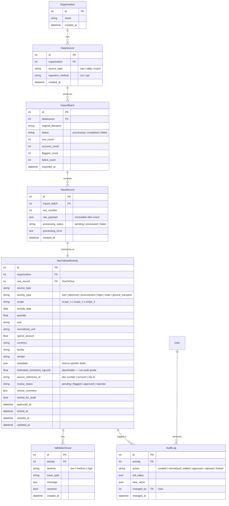

# Data model

This document describes the Breathe ESG database schema, relationships, and immutability rules.

## Entity relationship overview



**Lineage chain:** `AuditLog` → `NormalizedActivity` → `RawRecord` → `ImportBatch` → `DataSource` → `Organization`. Every approved or locked row traces back to the exact source file row.

**Hierarchy (simplified):**

```
Organization
    └── DataSource (sap | utility | travel)
            └── ImportBatch
                    └── RawRecord  ← immutable raw payload
                            └── NormalizedActivity  ← 1:1
                                    ├── ValidationIssue (many)
                                    └── AuditLog (many)
```

## Core app

### Organization

Multi-tenant root entity. The prototype uses one default organization (internal name only; not shown in the UI).

| Field | Type | Notes |
|-------|------|-------|
| id | PK | Auto |
| name | string | Organization name |
| created_at | datetime | Auto on create |

### DataSource

Registers a connected system per organization.

| Field | Type | Notes |
|-------|------|-------|
| organization | FK | Parent organization |
| source_type | choice | `sap`, `utility`, `travel` |
| ingestion_method | choice | `csv`, `api` |
| created_at | datetime | Auto on create |

Unique constraint: `(organization, source_type)`.

## Ingestion app

### ImportBatch

Tracks a single ingest operation.

| Field | Type | Notes |
|-------|------|-------|
| datasource | FK | Source system |
| original_filename | string | Uploaded file name or fixture name |
| status | choice | `processing`, `completed`, `failed` |
| row_count | int | Total rows ingested |
| success_count | int | Rows normalized successfully |
| flagged_count | int | Rows with at least one validation issue |
| failed_count | int | Rows that failed normalization |
| imported_at | datetime | Batch start time |

### RawRecord

Immutable copy of each source row.

| Field | Type | Notes |
|-------|------|-------|
| import_batch | FK | Parent batch |
| row_number | int | 1-based row index |
| raw_payload | JSON | Exact source fields; never updated after insert |
| processing_status | choice | `pending`, `processed`, `failed` |
| processing_error | text | Error message if normalization failed |
| created_at | datetime | Auto on create |

**Immutability:** `raw_payload` must not be modified after import. Reprocessing requires a new import batch.

## Normalization app

### NormalizedActivity

Canonical ESG activity layer. One activity per raw record.

| Field | Type | Notes |
|-------|------|-------|
| organization | FK | Tenant |
| raw_record | OneToOne | Lineage to source |
| source_type | string | `sap`, `utility`, `travel` |
| activity_type | choice | `fuel`, `electricity`, `procurement`, `flight`, `hotel`, `ground_transport` |
| scope | choice | `scope_1`, `scope_2`, `scope_3` |
| activity_date | date | Primary activity date |
| quantity | float | Physical quantity when applicable |
| unit | string | Source unit |
| normalized_unit | string | Standard unit (e.g. kWh) |
| spend_amount | float | Monetary amount when applicable |
| currency | string | ISO-style code |
| facility | string | Site or account identifier |
| vendor | string | Supplier or service provider |
| metadata | JSON | Source-specific fields (see below) |
| estimated_emissions_kgco2e | float | Static estimate; not audit-grade |
| source_reference_id | string | Document number, trip ID, account number |
| review_status | choice | `pending`, `flagged`, `approved`, `rejected` |
| review_comment | text | Analyst notes on approve/reject |
| locked_for_audit | bool | Terminal lock flag |
| approved_at | datetime | Set on approve |
| locked_at | datetime | Set on lock |
| created_at, updated_at | datetime | Auto |

**Metadata examples by source:**

SAP:

```json
{
  "document_number": "PR37",
  "fiscal_year": "2026",
  "accounting_period": "Q1",
  "cost_center": "CC100",
  "line_text": "Diesel Fuel",
  "transaction_type": "Fuel Purchase",
  "originating_system": "SAP Ariba"
}
```

Utility:

```json
{
  "account_number": "ACC1001",
  "meter_id": "MTR001",
  "billing_start": "2026-01-14",
  "billing_end": "2026-02-13",
  "service_type": "electricity",
  "notes": ""
}
```

Travel:

```json
{
  "trip_id": "TRIP1001",
  "booking_type": "air",
  "employee_id": "EMP001",
  "start_city_code": "HYD",
  "end_city_code": "DXB",
  "cabin": "Economy"
}
```

### ValidationIssue

Data quality findings attached to an activity.

| Field | Type | Notes |
|-------|------|-------|
| activity | FK | Parent activity |
| severity | choice | `low`, `medium`, `high` |
| issue_type | string | Machine-readable code |
| message | text | Human-readable description |
| resolved | bool | Soft-resolve flag |
| created_at | datetime | Auto |

Unique constraint: `(activity, issue_type)` to avoid duplicate issues on re-validation.

Common `issue_type` values: `missing_currency`, `malformed_date`, `negative_value`, `unknown_cost_center`, `missing_usage`, `suspicious_usage`, `overlapping_period`, `estimated_reading`, `unknown_airport`, `missing_miles`, `missing_emissions`, `incomplete_data`.

## Review app

### AuditLog

Append-only history of lifecycle events.

| Field | Type | Notes |
|-------|------|-------|
| activity | FK | Related activity |
| action | choice | `created`, `normalized`, `edited`, `approved`, `rejected`, `locked` |
| old_value | JSON | State before change |
| new_value | JSON | State after change |
| changed_by | FK User | Authenticated analyst |
| changed_at | datetime | Auto |

Audit logs are not deleted through the application API or admin.

## Scope mapping

| Source | Condition | activity_type | scope |
|--------|-----------|---------------|-------|
| SAP | Transaction type contains "Fuel" | fuel | scope_1 |
| SAP | Other | procurement | scope_3 |
| Utility | Electricity service | electricity | scope_2 |
| Travel | Air | flight | scope_3 |
| Travel | Hotel | hotel | scope_3 |
| Travel | Ride | ground_transport | scope_3 |

## Multi-tenancy

`Organization` is the tenant root. `DataSource`, `ImportBatch`, and `NormalizedActivity` all tie back to an organization (directly or through `DataSource` / `raw_record`).

**Prototype behavior:** A single default organization is used. All API list endpoints scope to that tenant via `get_tenant_organization()`.

**Production extension:** Many `Organization` rows per deployment; derive org from the authenticated user's membership and filter every queryset by `organization_id`. No schema migration required.

## Source-of-truth tracking

For each `NormalizedActivity`, lineage is explicit:

| Question | Where answered |
|----------|----------------|
| Which system produced this row? | `source_type`, `DataSource.ingestion_method` |
| Which import run? | `raw_record.import_batch_id`, `ImportBatch.imported_at` |
| Exact source fields? | `RawRecord.raw_payload` (immutable) |
| Business key from source? | `source_reference_id` (document number, account, trip id) |
| Was it edited after import? | Canonical fields change only through review actions; raw never changes |
| Who approved / locked? | `AuditLog` with `changed_by`, `approved_at`, `locked_at` |

Re-import policy in the prototype: upload a new file → new `ImportBatch`. Old raw records are not mutated.

## Unit normalization

| Source | Raw unit | Normalized | Notes |
|--------|----------|------------|-------|
| Utility | kWh (from CSV) | `normalized_unit = kWh` | Quantity stored as float |
| SAP spend | Currency amount | `spend_amount` + `currency` | No FX conversion |
| Travel | miles (optional) | Emissions estimate when miles or airport pair known | See `emissions.py` |

Unit conversion beyond kWh (e.g. MWh → kWh) would live in `UtilityNormalizer` when clients deliver mixed units.

## Immutability and lifecycle rules

1. **RawRecord.raw_payload** — write once at import; never updated.
2. **NormalizedActivity** — editable until `locked_for_audit` is true. A pre-save signal blocks changes to locked records.
3. **Lock** — only allowed when `review_status` is `approved`. Sets `locked_at` and `locked_for_audit`.
4. **Approve / reject** — blocked when locked. Optional `review_comment` stored on the activity and referenced in audit log `new_value`.
5. **Review status** — set to `flagged` automatically when any unresolved high-severity validation issue exists.

## Django apps

| App | Models |
|-----|--------|
| `apps.core` | Organization, DataSource |
| `apps.ingestion` | ImportBatch, RawRecord |
| `apps.normalization` | NormalizedActivity, ValidationIssue |
| `apps.review` | AuditLog |
