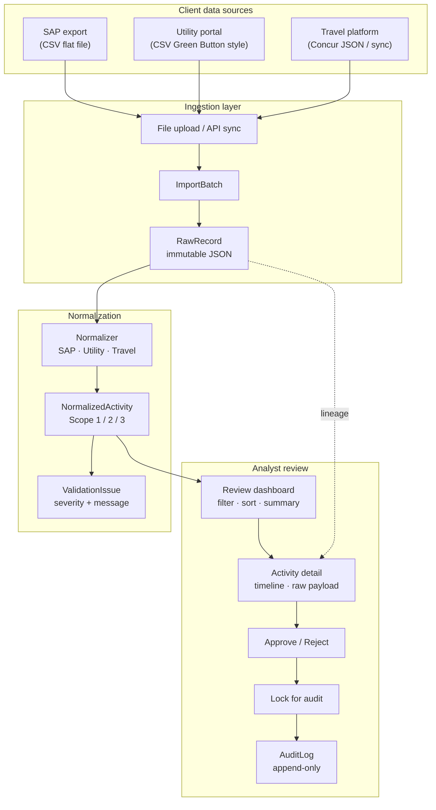
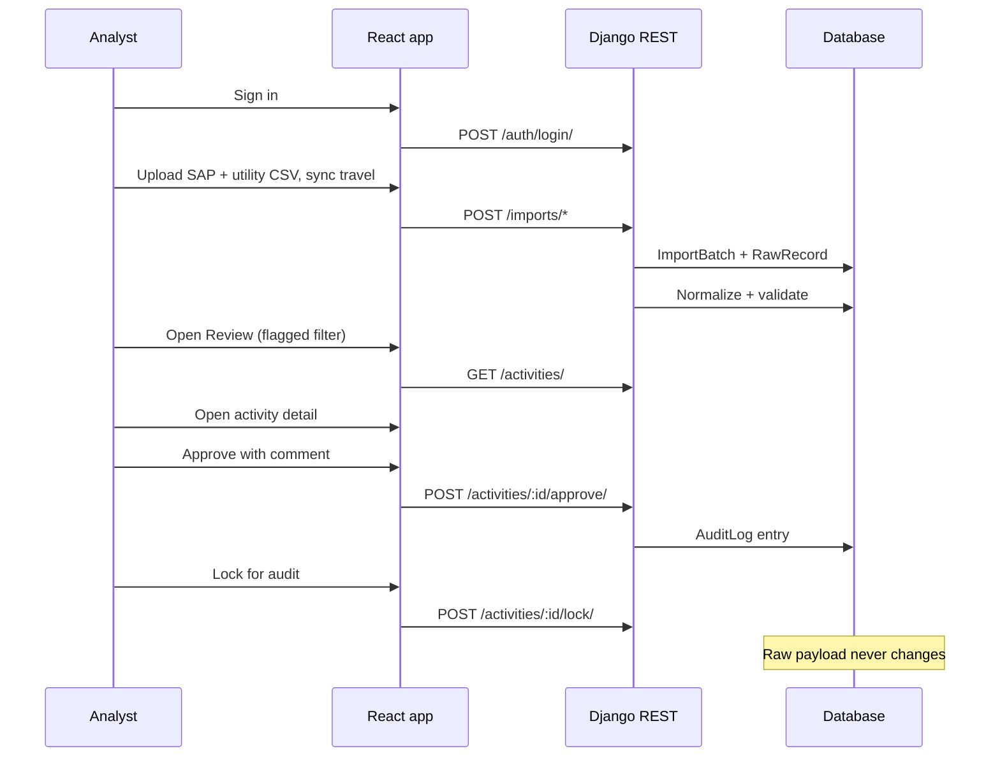

# Breathe ESG

Prototype for ingesting multi-source sustainability data (SAP, utility, travel), normalizing to a canonical ESG activity model, validating data quality issues, and supporting analyst review before records are locked for audit.

Built for the **Breathe ESG tech intern assignment**. The hard problem modeled here is **messy enterprise ingestion and analyst sign-off**, not carbon methodology.

## Live demo

**After you deploy**, paste your URLs here:

| Service | URL |
|---------|-----|
| Frontend | `https://YOUR-WEB.onrender.com` |
| API health | `https://YOUR-API.onrender.com/api/health/` |

**Login:** `analyst` / `analyst123` (from `seed_data`)

**3-minute walkthrough:** [DEMO_SCRIPT.md](DEMO_SCRIPT.md)

---

## Architecture flow (diagram)



---

## Analyst journey (sequence)



---

## Presenter script (short)

Read aloud while demoing — full version in [DEMO_SCRIPT.md](DEMO_SCRIPT.md).

| Step | Say | Do |
|------|-----|-----|
| 1 | "Three messy enterprise sources, one canonical model." | Show landing + research links |
| 2 | "Every import is a batch; raw JSON is immutable." | Upload SAP + utility; sync travel |
| 3 | "Validation flags suspicious rows for humans." | Review → filter flagged |
| 4 | "Analyst approves, then locks for auditors." | Detail → approve → lock → show audit + raw |
| 5 | "We documented what we did not build." | Mention TRADEOFFS.md |

**Before recording:** Upload → **Clear demo data**, then upload only `sap_budget_export.csv`, `utility_billing.csv`, and one travel sync.

---

## Assignment deliverables

| Deliverable | File |
|-------------|------|
| Data model | [MODEL.md](MODEL.md) |
| Decisions | [DECISIONS.md](DECISIONS.md) |
| Tradeoffs (3 cuts) | [TRADEOFFS.md](TRADEOFFS.md) |
| Research per source | [SOURCES.md](SOURCES.md) |
| Submit checklist | [SUBMISSION.md](SUBMISSION.md) |
| Run guide | [USAGE.md](USAGE.md) |

---

## Sample files (`samples/`)

Upload **your own CSV/JSON** if columns match. See [USAGE.md](USAGE.md).

| SAP | Utility | Travel |
|-----|---------|--------|
| sap_budget_export.csv | utility_billing.csv | Sync: default / domestic / international |
| sap_procurement_q2.csv | utility_campus_north.csv | travel_domestic_trips.json |
| sap_fuel_india.csv | utility_campus_south.csv | travel_international_trips.json |
| **sap_export_de_variant.csv** (German headers) | | |

---

## Stack

| Layer | Technology |
|-------|------------|
| Backend | Django 5, Django REST Framework |
| Database | PostgreSQL (SQLite locally via `USE_SQLITE=true`) |
| Frontend | React 18, Vite, TypeScript, Tailwind CSS |
| Tables | TanStack Table, TanStack Query |

---

## Quick start (local)

### Backend

```cmd
cd backend
pip install -r requirements.txt
set USE_SQLITE=true
python manage.py migrate
python manage.py seed_data
python manage.py runserver
```

### Frontend

```cmd
cd frontend
npm install
npm run dev
```

Open http://localhost:5173

---

## Deploy to Render (required for submission)

1. Push repo to GitHub; invite reviewers (see [SUBMISSION.md](SUBMISSION.md)).
2. Render → **New → Blueprint** → select `render.yaml`.
3. When API is live, set on **static site** service:
   - `VITE_API_URL` = `https://YOUR-API.onrender.com/api`
4. On **API** service:
   - `CORS_ALLOWED_ORIGINS` = `https://YOUR-WEB.onrender.com`
   - `CSRF_TRUSTED_ORIGINS` = same URL
5. Redeploy both. Test `https://YOUR-API.onrender.com/api/health/` → `{"status":"ok"}`.
6. Paste live URLs into this README and your submission email.

---

## API endpoints

| Method | Path | Purpose |
|--------|------|---------|
| GET | `/api/health/` | Health check |
| POST | `/api/auth/login/` | Session login |
| GET | `/api/auth/me/` | Current user |
| POST | `/api/imports/sap/` | SAP CSV upload |
| POST | `/api/imports/utility/` | Utility CSV upload |
| POST | `/api/imports/travel-sync/?dataset=` | Travel fixture sync |
| POST | `/api/imports/travel/` | Travel JSON upload |
| POST | `/api/demo/reset/` | Clear all demo batches |
| GET | `/api/import-batches/` | List batches |
| GET | `/api/activities/summary/` | Review totals |
| GET | `/api/activities/` | List activities |
| POST | `/api/activities/:id/approve/` | Approve |
| POST | `/api/activities/:id/lock/` | Lock for audit |

## Clear test data

- **UI:** Upload → **Clear demo data**
- **CLI:** `python manage.py reset_demo_data`

---

## Research references

- SAP: [Procurement Admin PDF](https://help.sap.com/doc/6c6aa6afc1da10149a5eec27ae2c573b/2605/en-US/ProcurementAdmin.pdf)
- Utility: [Oracle Green Button](https://docs.oracle.com/en/industries/utilities/digital-self-service/energy-management-overview/green-button-downloadmydata.html#GUID-51913E15-170B-4856-A8F8-4C74A8321134)
- Travel: [Concur Itinerary API](https://github.com/concur/developer.concur.com/blob/preview/src/api-reference/travel/itinerary/itinerary.markdown)

---

## Tests

```cmd
cd backend
set USE_SQLITE=true
python manage.py test apps.normalization
```
