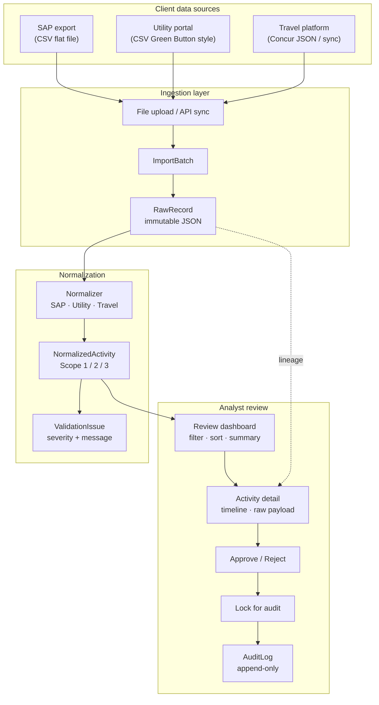
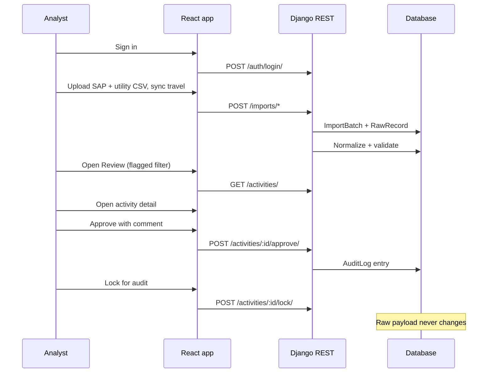

# Breathe ESG

Prototype for ingesting multi-source sustainability data (SAP, utility, travel), normalising to a canonical ESG activity model, validating data quality issues, and supporting analyst review before records are locked for audit.

Built for the **Breathe ESG tech intern assignment**. The hard problem modelled here is **messy enterprise ingestion and analyst sign-off**, not carbon methodology.

---

## Live demo

**After you deploy**, paste your URLs here:

| Service | URL |
|---------|-----|
| Frontend | `https://YOUR-WEB.onrender.com` |
| API health | `https://YOUR-API.onrender.com/api/health/` |

**Login:** `analyst` / `analyst123`

---

## Architecture flow



---

## Analyst journey



---

## Assignment deliverables

| Document | Purpose |
|----------|---------|
| [MODEL.md](MODEL.md) | Data model, tenancy, lineage, immutability |
| [DECISIONS.md](DECISIONS.md) | Ambiguities resolved, per-source scope |
| [TRADEOFFS.md](TRADEOFFS.md) | Three deliberate non-builds |
| [SOURCES.md](SOURCES.md) | Research per source, sample data rationale |

---

## Sample files (`samples/`)

Upload your own CSV/JSON if column headers match the samples.

| SAP | Utility | Travel |
|-----|---------|--------|
| sap_budget_export.csv | utility_billing.csv | Sync: default / domestic / international |
| sap_procurement_q2.csv | utility_campus_north.csv | travel_domestic_trips.json |
| sap_fuel_india.csv | utility_campus_south.csv | travel_international_trips.json |
| sap_export_de_variant.csv (German headers) | | |

---

## Stack

| Layer | Technology |
|-------|------------|
| Backend | Django 5, Django REST Framework |
| Database | PostgreSQL (SQLite locally via `USE_SQLITE=true`) |
| Frontend | React 18, Vite, TypeScript, Tailwind CSS |
| Tables | TanStack Table, TanStack Query |

---

## Quick start (local)

**Backend**

```cmd
cd backend
pip install -r requirements.txt
set USE_SQLITE=true
python manage.py migrate
python manage.py seed_data
python manage.py runserver
```

**Frontend**

```cmd
cd frontend
npm install
npm run dev
```

Open http://localhost:5173

---

## Deploy to Render

### 1. Backend (Web Service, root `backend`)

| Variable | Example value |
|----------|----------------|
| `USE_SQLITE` | `true` |
| `DJANGO_DEBUG` | `false` |
| `DJANGO_SECRET_KEY` | (generate) |
| `DJANGO_ALLOWED_HOSTS` | `.onrender.com` |
| `COOKIE_DOMAIN` | `.onrender.com` |
| `CORS_ALLOWED_ORIGINS` | `https://YOUR-FRONTEND.onrender.com` (no trailing `/`) |
| `CSRF_TRUSTED_ORIGINS` | `https://YOUR-FRONTEND.onrender.com` (no trailing `/`) |

Test: `https://YOUR-API.onrender.com/api/health/` → `{"status":"ok"}`

### 2. Frontend (Static Site, root `frontend`)

| Variable | Example value |
|----------|----------------|
| `VITE_API_URL` | `https://YOUR-API.onrender.com/api` |

**Important:** Vite bakes `VITE_API_URL` at **build time**. After changing it, use **Manual Deploy → Clear build cache & deploy** on the static site.

### Your URLs (example)

| | URL |
|---|-----|
| API | `https://esg-normalization-platform.onrender.com/api` |
| Frontend | `https://esg-normalization-platform-1.onrender.com` |

If login shows **Failed to fetch**, the static site was built without `VITE_API_URL` or the API is down — fix env vars and redeploy the frontend.

---

## API endpoints

| Method | Path | Purpose |
|--------|------|---------|
| GET | `/api/health/` | Health check |
| POST | `/api/auth/login/` | Session login |
| GET | `/api/auth/me/` | Current user |
| POST | `/api/imports/sap/` | SAP CSV upload |
| POST | `/api/imports/utility/` | Utility CSV upload |
| POST | `/api/imports/travel-sync/?dataset=` | Travel fixture sync |
| POST | `/api/imports/travel/` | Travel JSON upload |
| POST | `/api/demo/reset/` | Clear all demo batches |
| GET | `/api/import-batches/` | List batches |
| GET | `/api/activities/summary/` | Review totals |
| GET | `/api/activities/` | List activities |
| POST | `/api/activities/:id/approve/` | Approve |
| POST | `/api/activities/:id/reject/` | Reject |
| POST | `/api/activities/:id/lock/` | Lock for audit |

---

## Research references

- SAP: [Procurement Admin PDF](https://help.sap.com/doc/6c6aa6afc1da10149a5eec27ae2c573b/2605/en-US/ProcurementAdmin.pdf)
- Utility: [Oracle Green Button](https://docs.oracle.com/en/industries/utilities/digital-self-service/energy-management-overview/green-button-downloadmydata.html#GUID-51913E15-170B-4856-A8F8-4C74A8321134)
- Travel: [Concur Itinerary API](https://github.com/concur/developer.concur.com/blob/preview/src/api-reference/travel/itinerary/itinerary.markdown)

---

## Tests

```cmd
cd backend
set USE_SQLITE=true
python manage.py test apps.normalization
```
